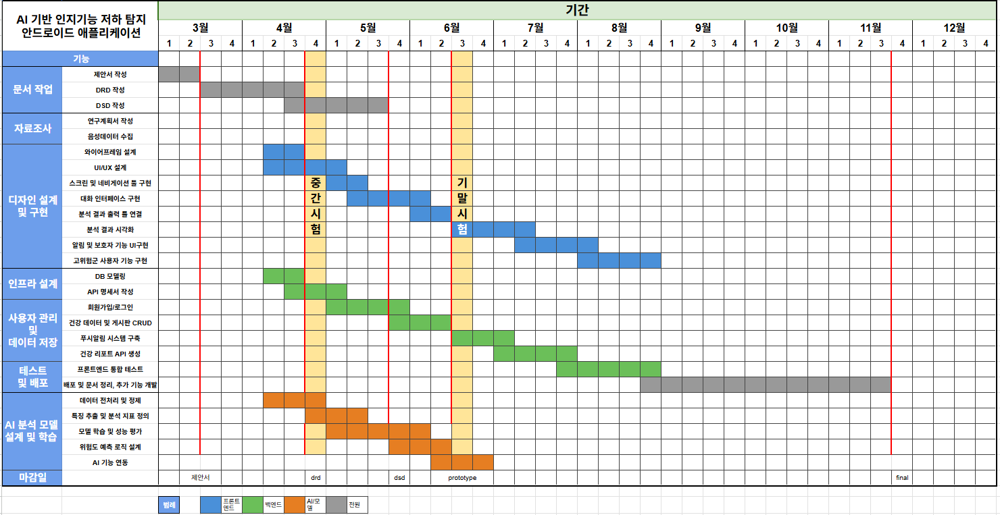

# DRD 문서

영남대학교 컴퓨터공학과

| 학번 | 이름 |
|------|------|
| 22210599 | 김민정 |
| 22210596 | 전선영 |
| 22213490 | 이주연 |
| 22112045 | 김형섭 |
| 22012158 | 김경빈 |
| 22113640 | 김동현 |

---

## 목차

1. [설계 개요](#1-설계-개요)
   - 1.1 개발 배경
   - 1.2 개발 목표
   - 1.3 시스템 기능
   - 1.4 설계 제한사항
   - 1.5 Specification
2. [경쟁 제품 분석](#2-경쟁-제품-분석)
   - 2.1 국내 시장
   - 2.2 국외 시장
   - 2.3 경쟁 제품 비교
   - 2.4 설계 반영
3. [Market 분석](#3-market-분석)
   - 3.1 Market 현황 분석
   - 3.2 기존 Market과의 차별성
   - 3.3 타깃 정의
   - 3.4 타깃 규모 추정
   - 3.5 참고 자료
4. [특허분석](#4-특허분석)
5. [개발 비용](#5-개발-비용)
   - 5.1 장비 구입비
   - 5.2 소프트웨어 도구 사용료
   - 5.3 배포비용
   - 5.4 인건비
6. [판매 방법 및 예측](#6-판매-방법-및-예측)
   - 6.1 판매 방법
   - 6.2 국내 시장 판매 예측
   - 6.3 참고자료
7. [수행 방법](#7-수행-방법)
   - 7.1 개발 환경
   - 7.4 개발 도구
8. [수행 계획](#8-수행-계획)
9. [프로젝트 수행 계획](#9-프로젝트-수행-계획)
   - 9.1 Gantt Chart

---
## 2. 경쟁 제품 분석
 
### 2.1 국내 시장
 
#### 2.1.1 치매체크
 
중앙치매센터에서 공식적으로 제공하는 모바일 앱은 스마트폰으로 치매 위험을 스스로 진단하고 예방 정보를 받을 수 있도록 도와준다. 사용자는 간단한 설문을 통해 자신의 인지 상태를 점검할 수 있고, 그 결과에 따라 개인별로 맞는 예방 정보를 안내받게 된다. 보호자와의 연계 기능을 통해 함께 관리할 수 있어서, 사용자 상태를 더 꼼꼼히 챙길 수 있다. 위치 기반 안전 관리 기능 등도 갖추고 있어, 다양한 상황에서 도움을 받을 수 있다.
 
이 앱의 가장 큰 장점은 보건복지부와 중앙치매센터 같은 공공기관에서 운영해 신뢰도가 높다는 점이다. 게다가 무료로 이용할 수 있어 접근성이 뛰어나다. 인지 상태를 간단한 설문만으로 확인할 수 있다는 점도 편리하다. 하지만 사용자의 데이터를 계속해서 분석하고 변화 추이를 상세히 추적하는 기능은 아직 부족한 편이다.
 

**[그림 1] '치매체크' 앱 화면**
 
#### 2.1.2 인지케어
 
일상 활동과 감정 기록을 바탕으로 인지 건강을 관리할 수 있도록 만들어진 모바일 애플리케이션이다. 사용자가 평소에 어떤 생활을 하는지 데이터를 모아 간단하게 인지 관리 기능을 제공한다. 앱을 계속 사용하다 보면 자연스럽게 자신의 건강 상태도 살필 수 있다.
 
특히, 이 앱은 고령자도 쉽게 사용할 수 있도록 UI와 UX를 신경 써서 만들었다. 사용자가 꾸준히 앱을 이용하도록 유도하는 다양한 기능도 갖추고 있다. 또, 하루하루의 생활 데이터를 바탕으로 건강 관리를 할 수 있다는 점도 장점이다. 다만, 현재 인지 상태가 나빠지고 있다는 사실을 미리 알려주는 탐지 기능은 아직 포함되어 있지 않다.
 

**[그림 2] '인지케어' 앱 화면**
 
### 2.2 국외 시장
 
#### 2.2.1 Lumosity
 
전 세계적으로 널리 사용되는 두뇌 훈련 애플리케이션으로, 다양한 인지 능력 향상 게임을 제공한다. 사용자 데이터를 기반으로 인지 능력을 분석하고 개인 맞춤형 훈련 프로그램을 제공한다. 최근 두뇌 훈련 앱 시장 규모는 2025년 기준 97억 6천만 달러로 추정되며, 2033년까지 393억 7천만 달러에 도달할 것으로 예상하고 있다고 한다. 이렇듯 두뇌 훈련 앱 시장은 모든 연령대의 사람들이 정신 건강과 인지 능력에 대한 인식을 높여가며 성장하고 있는데, 'Lumosity'와 같은 서비스는 두뇌 훈련 앱 시장 확대를 대표하는 사례이다.
 
'Lumosity'는 다양한 인지 훈련 콘텐츠 제공과 사용자 친화적인 인터페이스를 통해 글로벌 사용자를 확보하고 있다. 다만, 이 앱은 두뇌 훈련 애플리케이션으로 훈련 중심 서비스이기 때문에, 실제 인지 저하를 탐지하는 기능이 부족하다.
 

**[그림 3] 'Lumosity' 앱 화면**
 
#### 2.2.2 CogniFit
 
'CogniFit'은 인지 평가와 훈련을 한 번에 제공하는 AI 기반 서비스로, 여러 가지 인지 테스트와 데이터 분석 기능을 갖추고 있다. 의료나 연구 등 전문 분야에서도 활용될 만큼 신뢰도가 높아 평가받고 있다. 인지 평가 및 분석 시장은 최근 들어 연평균 16%가 넘는 성장률을 기록하고 있어, 2030년에는 시장 규모가 약 200억 1000만 달러에 이를 것으로 전망된다.
 
이 앱의 장점은 과학적인 인지 평가 시스템을 바탕으로 다양한 인지 영역을 분석할 수 있다는 점이다. 또, 장기간 데이터를 모아 시각화를 지원하므로 변화 추이를 한눈에 볼 수 있다. 다만, 일상 대화 데이터를 반영하지 않는다는 점 그리고 조기 발견보다는 검사와 훈련에 초점을 맞춘 서비스라는 한계가 있다.
 

**[그림 4] 'CogniFit' 앱 화면**
 
### 2.3 경쟁 제품 비교
 
다음은 경쟁 제품과 본 시스템과의 기능을 비교분석한 표이다.
 
| 구분 | 음성 분석 | 텍스트 분석 | 기억 평가 | 접근성 | 특징 |
|------|-----------|-------------|-----------|--------|------|
| 치매체크 | X | X | X | 높음 | 자가 진단 |
| 인지케어 | X | X | X | 높음 | 생활 관리 |
| Lumosity | X | X | X | 높음 | 훈련 중심 |
| CogniFit | X | 제한적 | X | 높음 | 평가+훈련 |
| **본 시스템** | **O** | **O** | **O** | **높음** | **조기 탐지** |
 
**[표 2] 경쟁 제품과의 비교 분석표**
 
경쟁 제품을 비교해 보면, 국내외 서비스 모두 인지 기능 관리에 대해 다양한 접근을 시도하고 있다. 하지만 기능적인 면에서는 여전히 한계가 나타난다.
 
먼저 국내 서비스인 '치매체크'와 '인지케어'는 접근성이 좋고, 주로 고령층 사용자를 고려해 사용자 친화적인 인터페이스를 갖추고 있다는 점이 장점이다. 다만, 설문 기반 자가 진단이나 생활 기록을 중심으로 관리 기능이 구성되어 있다. 그래서 데이터를 활용한 정밀 분석은 부족하고, 인지 기능 저하를 조기에 발견하는 데 어려움이 있다.
 
해외 서비스는 다양한 인지 능력 평가와 훈련 기능을 제공하고, 데이터 기반 분석 측면에서는 국내보다 상대적으로 발전된 편이다. 특히 사용자 수행 데이터를 토대로 인지 상태를 평가하고 시각화하는 기능이 뛰어나다. 그러나 국내 서비스와 마찬가지로 음성이나 텍스트 기반 분석 기능은 제공하지 않고, 실제 일상 대화 데이터를 활용한 분석도 부족한 실정이다. 그리고 앞서 언급한 'Lumosity'와 'CogniFit' 역시 훈련과 평가에 초점을 둔 구조라 인지 저하를 조기에 포착하는 데에는 한계가 있다.
 
### 2.4 설계 반영
 
국내외 경쟁 제품을 살펴보면, 다음과 같은 특징이 나타난다. 국내 서비스는 주로 자가 진단과 관리에 초점을 맞추고 있지만 분석 기능이 다소 부족하다. 반면, 해외 서비스는 훈련과 평가에 중점을 두지만 평소의 일상 데이터를 제대로 반영하지 못하는 문제가 있다. 또 하나 눈에 띄는 점은, 국내외를 막론하고 음성과 텍스트를 함께 분석하는 통합 기능이 거의 없다는 점이다.
 
이런 점을 고려해 본 시스템은 몇 가지 차별화를 시도하였다. 첫째, 음성과 텍스트는 물론 기억력 평가까지 함께 분석하도록 설계하였다. 둘째, 사용자와의 일상 대화를 통해 자연스럽게 데이터를 모으도록 하였다. 셋째, 이렇게 수집된 데이터에서 시간에 따라 어떻게 변화하는지 지속적으로 추적하고, 그 변화를 시각적으로 보여주도록 하였다.

---
## 3. Market 분석

### 3.1 Market 현황 분석

한국은 빠르게 고령화되고 있어 본 제품의 사회적 필요성이 커지고 있다. 통계청은 2025년 기준 65세 이상 고령인구가 전체 인구의 20.3%를 차지하며, 한국이 초고령사회에 진입한 것으로 설명하였다. 또한 향후 고령인구 비중은 계속 증가하여 2036년에는 30%, 2050년에는 40%를 넘어설 것으로 전망된다.

**[그림 5] 2024년 기준 국내 65세 이상 노인 인구 및 추정 치매 환자 현황**  
출처: 중앙치매센터, 대한민국 치매현황 2024

중앙치매센터에 따르면 2024년 기준 한국의 65세 이상 노인 인구는 9,955,476명이며, 추정 치매 환자 수는 약 910,898명, 추정 치매 유병률은 약 9.15%이다. 즉 한국에서는 이미 65세 이상 노인 10명 중 약 1명 수준의 치매 관련 위험군이 존재하는 셈이며, 조기 선별과 지속적인 관찰에 대한 수요가 크다고 볼 수 있다.

치매는 단순한 개인의 건강 문제가 아니라 가족과 사회 전체의 돌봄 부담으로 이어진다. 특히 가족 보호자는 환자의 상태 변화를 지속적으로 관찰해야 하며, 병원 방문이나 정밀검사 이전 단계에서 일상적인 변화를 확인할 수 있는 보조 도구에 대한 필요성이 존재한다. 따라서 음성, 언어, 기억 일치도 변화를 기반으로 인지기능 저하 위험 가능성을 조기에 확인하는 본 시스템은 사회적·시장적 필요성이 있다고 판단된다.

### 3.2 기존 Market과의 차별성

기존의 인지기능 또는 치매 관련 자가 점검 서비스는 주로 설문형 검사나 문답형 검사에 집중되어 있다. 이러한 방식은 사용자가 정해진 질문에 답변하는 구조이기 때문에 간단하게 사용할 수 있다는 장점이 있지만, 실제 일상 대화에서 나타나는 음성 변화, 언어 사용 변화, 기억 일치도 변화까지 함께 확인하기에는 한계가 있다.

본 시스템은 다음과 같은 차별성을 가진다.

#### 3.2.1 음성, 텍스트, 회상 정확도 결합

본 시스템은 사용자의 음성 데이터에서 발화 속도, 음성 에너지, 음향적 변동성 등을 분석하고, STT 변환 텍스트를 기반으로 문장 길이, 어휘 다양도, 반복 표현 등을 분석한다. 또한 이전 답변과 이후 회상 답변을 비교하여 기억 일치도를 평가한다.

즉, 단순 설문 점수만 확인하는 것이 아니라 음성 특징, 언어 특징, 회상 정확도를 함께 활용하여 인지기능 저하 위험 가능성을 다각도로 파악한다.

#### 3.2.2 추세 모니터링 중심

본 시스템은 단발성 검사 결과보다 사용자의 반복적인 점검 기록과 시간에 따른 변화 추적에 초점을 둔다. 사용자가 주기적으로 음성 점검을 수행하면, 시스템은 이전 기록과 현재 기록을 비교하여 발화 속도, 언어 사용, 회상 일치도 등이 어떻게 변화하는지 확인할 수 있다.

이를 통해 사용자는 단순히 “정상/비정상” 여부를 확인하는 것이 아니라, 자신의 상태가 시간이 지나면서 어떻게 변화하는지 확인할 수 있다.

#### 3.2.3 보호자·가족 연계성

인지기능 저하 관련 서비스는 실제 사용자는 고령자 본인이지만, 설치, 관리, 사용 권유, 비용 지불 등의 의사결정은 보호자나 성인 자녀가 주도할 가능성이 높다. 따라서 본 시스템은 사용자 본인뿐만 아니라 보호자가 사용자의 점검 결과와 변화 추세를 확인할 수 있는 구조로 확장할 수 있다.

이는 가족이 병원 방문 이전 단계에서 사용자의 상태 변화를 일상적으로 관찰하고, 필요할 경우 전문기관 방문을 권유할 수 있도록 돕는다.

### 3.3 타깃 정의

본 시스템의 주요 타깃은 다음과 같다.

#### 3.3.1 60~74세의 디지털 접근 가능한 중장년·초기 노년층

앱 기반 서비스이므로 스마트폰 사용이 가능한 60대 후반~70대 초반 사용자를 초기 핵심 타깃으로 설정한다. 이들은 건강 관리에 대한 관심이 높고, 병원 방문이나 정밀검사에는 부담을 느끼지만 간단한 자가 점검 서비스에는 접근할 가능성이 있다.

특히 75세 이상 고령층 전체를 초기 타깃으로 설정하기보다는, 스마트폰과 인터넷 사용에 비교적 익숙한 60대~초기 70대 사용자에게 먼저 맞추는 것이 현실적이다.

#### 3.3.2 보호자, 성인 자녀, 배우자

치매 및 인지기능 저하 관련 서비스는 사용 당사자보다 가족이 더 적극적으로 필요성을 느낄 가능성이 있다. 특히 부모님의 기억력 저하, 말의 반복, 대화 흐름 변화 등을 걱정하는 성인 자녀나 배우자는 사용자의 상태를 주기적으로 확인하고 싶어 할 수 있다.

따라서 본 시스템은 고령 사용자뿐만 아니라 보호자와 가족을 중요한 타깃으로 설정한다.

#### 3.3.3 기관 시장

장기적으로는 치매안심센터, 노인복지관, 방문간호 기관, 실버타운, 요양기관, 임상연구 조직 등이 B2B 고객 후보가 될 수 있다. 이러한 기관은 다수의 고령자를 대상으로 정기적인 관찰과 선별이 필요하기 때문에, 본 시스템을 보조적인 모니터링 도구로 활용할 가능성이 있다.

#### 3.3.4 핵심 사용자 특성

본 시스템의 핵심 사용자 특성은 다음과 같다.

1. 건강 불안은 있으나 병원 방문은 부담스러운 사람
2. 정식 검사보다 간편한 자가 점검을 선호하는 사람
3. 확진보다 추세 변화 확인에 의미를 두는 사람
4. 본인보다 가족이 더 적극적으로 사용을 권유할 가능성이 높은 사람

### 3.4 타깃 규모 추정

#### 3.4.1 TAM: 총 잠재시장

TAM은 본 시스템이 장기적으로 접근할 수 있는 전체 잠재시장이다. 넓은 의미에서 한국의 65세 이상 인구 약 995만 명 전체를 잠재 사용자로 볼 수 있다. 이 중 추정 치매 환자 약 91만 명뿐만 아니라, 경도인지장애 우려자, 기억력 저하를 걱정하는 고령층, 가족 관찰 필요군까지 포함하면 시장 기반은 매우 넓다.

본 시스템은 의료 진단 도구가 아니라 일상적인 인지기능 저하 위험 가능성 확인 및 변화 추적 도구이므로, 실제 치매 환자뿐만 아니라 예방적 관리를 원하는 고령층과 보호자까지 잠재시장에 포함할 수 있다.

#### 3.4.2 SAM: 서비스 가능 시장

SAM은 본 시스템이 실제 초기 단계에서 접근 가능한 시장이다. 본 제품은 앱 기반 서비스이므로, 스마트폰과 인터넷 사용이 가능한 60대~초기 70대 고령층과 보호자 집단을 초기 서비스 가능 시장으로 설정하는 것이 타당하다.

고령층 전체를 바로 대상으로 하기보다는 디지털 접근성이 있는 사용자와 보호자 중심으로 시장을 잡는 것이 현실적이다. 특히 보호자는 앱 설치, 사용 안내, 결과 확인, 병원 방문 권유 등의 과정에서 중요한 역할을 할 수 있으므로 초기 확산 과정에서 핵심 사용자층으로 볼 수 있다.

#### 3.4.3 SOM: 초기 확보 가능 시장

SOM은 실제 초기 출시 이후 확보 가능한 시장이다. 초기에는 전국 고령층 전체를 대상으로 하기보다 다음과 같은 소규모 집단을 중심으로 서비스를 검증하는 것이 적절하다.

1. 가족의 권유로 앱을 설치한 60~74세 사용자
2. 부모님의 인지기능 변화를 확인하고 싶은 보호자
3. 노인복지관 또는 지역 커뮤니티 기반 시범 사용자
4. 졸업작품 시연 및 테스트에 참여하는 제한된 사용자 집단

초기 목표는 대규모 상용화보다 사용자가 앱을 통해 음성 점검을 수행하고, 분석 결과와 변화 추세를 이해할 수 있는지 검증하는 데 있다.

### 3.5 참고 자료

- 통계청, 「2025 고령자 통계」
- 중앙치매센터, 「대한민국 치매현황 2024」
- 과학기술정보통신부·한국지능정보사회진흥원, 「인터넷이용실태조사」
- IDC, 「아시아 태평양의 AI 기반 의료: 2025년 및 그 이후의 미래」
- Gartner, 「Hype Cycle 2025」
- 디지털 치료제 시장 규모 관련 산업 보고서

---

## 4. 특허분석

### 4.1 특허분석 개요

본 프로젝트와 관련된 특허는 주로 음성 데이터를 이용한 인지기능 저하, 알츠하이머병, 조기치매, 우울증 및 불안 증상 판별 기술에 집중되어 있다. 기존 특허들은 음성의 발화 속도, 음도, 단어 사용 빈도, 응답 지연, 발음 정확도 등을 분석하여 치매 또는 정신건강 이상 징후를 판단하는 방식이 많다.

본 시스템은 이러한 기존 기술 흐름을 참고하되, 음성 분석만 수행하는 것이 아니라 STT 기반 텍스트 분석과 회상 일치도 분석을 함께 결합한다는 점에서 차별성을 가진다.

### 4.2 관련 특허 조사

#### 4.2.1 음성 특성 기반 알츠하이머병 예측 방법 및 장치

- 출원번호: 10-2021-0089014
- 출원일: 2021.07.07
- 주요 내용: 음성 데이터를 입력받아 음성 특성을 추출하고, 이를 바탕으로 알츠하이머병 여부 또는 위험을 예측하는 방법 및 장치에 관한 특허이다.
- 관련성: 본 프로젝트의 음성 특징 분석 모듈과 관련성이 있다. 본 시스템도 사용자의 음성에서 음향 특징을 추출하고 위험 점수 산출에 활용한다.

#### 4.2.2 인공지능 기반의 음성분석을 통한 우울증, 불안증, 조기치매 또는 자살 징후 조기판별 시스템

- 출원번호: 10-2017-0184298
- 출원일: 2017.12.29
- 주요 내용: 사용자의 일상 음성을 녹음 및 수집한 뒤, 음도, 발화 속도, 특정 단어 사용 빈도 등을 분석하여 우울증, 불안증, 조기치매, 자살 징후 등을 조기 판별하는 시스템에 관한 특허이다.
- 관련성: 본 프로젝트의 일상 대화 기반 음성 수집 및 발화 특징 분석 방향과 유사하다. 다만 본 시스템은 조기치매 판별 자체보다는 인지기능 저하 위험 가능성을 선별하고, 변화 추세를 확인하는 보조 도구로 설계한다.

#### 4.2.3 음성 통화 정보를 이용한 알츠하이머병 진단 장치 및 방법

- 출원번호: 10-2010-0137246
- 공개번호: KR20120070668A
- 주요 내용: 전화 통화 중 수집된 음성 정보를 분석하여 말하기 지연, 어휘력, 발음 정확도, 일관성, 흥분도, 무력감 등을 기준으로 알츠하이머병 증상을 판정하는 장치 및 방법에 관한 특허이다.
- 관련성: 본 프로젝트도 사용자의 대화 음성을 분석한다는 점에서 관련성이 있다. 그러나 본 시스템은 전화 통화가 아니라 앱 내 AI 대화 및 회상 질문을 통해 데이터를 수집한다는 차이가 있다.

#### 4.2.4 질문과 답변을 이용한 인공지능 콜 기반 치매 검사 방법 및 서버

- 출원번호: 10-2021-0179397
- 출원인: 주식회사 세븐포인트원
- 주요 내용: 인공지능 콜을 통해 질문을 제시하고, 사용자의 답변을 받아 치매 여부를 검사하는 방법 및 서버에 관한 특허이다.
- 관련성: 본 프로젝트의 질문-답변 기반 인지기능 점검 구조와 관련성이 있다. 다만 본 시스템은 콜 기반 검사보다 모바일 앱 기반의 일상 점검과 기록 추적에 초점을 둔다.

### 4.3 특허분석 결과

관련 특허를 분석한 결과, 기존 기술은 주로 다음과 같은 방향으로 구성되어 있다.

1. 음성 데이터를 수집한다.
2. 발화 속도, 음도, 발음 정확도, 특정 단어 사용 빈도 등을 분석한다.
3. 분석 결과를 바탕으로 치매, 알츠하이머병, 조기치매 또는 정신건강 이상 징후를 판단한다.

즉, 기존 특허들은 음성 분석을 중심으로 한 질환 예측 또는 판별 기술에 집중되어 있다. 그러나 국내외 기존 기술에서 음성 특징, 텍스트 특징, 회상 일치도, 시간에 따른 변화 추적을 하나의 앱 서비스 흐름 안에서 통합적으로 제공하는 사례는 상대적으로 제한적이다.

### 4.4 본 시스템의 차별화 방향

본 시스템은 기존 특허와 비교하여 다음과 같은 차별화를 시도한다.

#### 4.4.1 음성, 텍스트, 기억력 평가의 통합 분석

본 시스템은 음성 특징만 분석하지 않고, STT 변환 텍스트를 기반으로 언어 사용 특성을 함께 분석한다. 또한 사용자의 이전 답변과 이후 회상 답변을 비교하여 기억 일치도를 평가한다. 이를 통해 단일 음성 지표에 의존하지 않고, 여러 유형의 데이터를 함께 활용할 수 있다.

#### 4.4.2 일상 대화 기반 데이터 수집

본 시스템은 사용자가 검사지를 푸는 방식이 아니라 AI와의 자연스러운 대화 속에서 데이터를 수집한다. 사용자는 일상적인 질문에 답변하고, 시스템은 그 과정에서 음성, 텍스트, 회상 정보를 분석한다.

#### 4.4.3 추세 변화 중심의 모니터링

본 시스템은 한 번의 검사 결과로 사용자를 판단하는 것이 아니라, 사용자의 기록을 누적하여 시간에 따른 변화를 확인하는 것을 목표로 한다. 이를 통해 사용자는 발화 속도, 반복 표현, 회상 정확도 등이 이전보다 변화했는지 확인할 수 있다.

#### 4.4.4 보호자 연계 가능성

본 시스템은 고령 사용자 본인뿐 아니라 보호자가 사용자의 변화 추세를 확인할 수 있는 구조로 확장 가능하다. 따라서 가족이 병원 방문 이전 단계에서 사용자의 상태 변화를 관찰하고, 필요 시 전문기관 방문을 권유할 수 있도록 돕는다.

### 4.5 특허 회피 및 설계상 유의점

본 프로젝트는 기존 특허와 유사하게 음성 및 질문-답변 데이터를 활용하지만, 의료적 진단이나 확정 판정을 제공하지 않는다. 본 시스템의 목적은 인지기능 저하 가능성을 참고용으로 확인하고, 사용자의 변화 추세를 시각적으로 제공하는 데 있다.

따라서 문서와 앱 화면에서는 다음과 같은 표현을 사용하지 않도록 한다.

- “치매 진단”
- “알츠하이머병 확진”
- “의학적 판정”
- “치매 여부 결정”

대신 다음과 같은 표현을 사용한다.

- “인지기능 저하 위험 가능성”
- “자가 점검”
- “변화 추세 확인”
- “전문기관 방문 참고 자료”
- “선별 보조 도구”

---

## 7. 수행 방법

본 프로젝트는 모바일 애플리케이션과 서버 기반 분석 시스템으로 구성되며, 다음과 같은 개발 환경에서 개발을 수행한다.

### 7.1 개발 환경

#### 7.1.1 클라이언트 환경

- 운영체제: Android
- 개발 언어: Kotlin
- 개발 플랫폼: Android Studio
- 주요 기능:
  - 사용자 음성 입력 및 대화 인터페이스 제공
  - 분석 결과 시각화 및 사용자 UI 구현
  - 알림 및 보호자 연동 기능 제공

#### 7.1.2 서버 환경

- 운영체제: Linux 기반 서버
- 개발 언어: Java
- 프레임워크: Spring Boot
- 주요 기능:
  - 사용자 데이터 처리 및 저장
  - 음성 및 텍스트 데이터 분석
  - AI 모델 및 외부 API 연동 처리

#### 7.1.3 데이터베이스 환경

- DBMS: MySQL
- 주요 기능:
  - 사용자 음성 및 텍스트 데이터 저장
  - 대화 기록 및 기억 일치도 데이터 관리

프로젝트 수행 시 다음과 같은 사양을 필요로 한다.

- Client OS: Android 11 (API 30) 이상
- Client H/W: RAM 4GB 이상, 마이크, 스피커, GPS 내장
- Permissions: 마이크, 저장소, 위치(필요시), 알림(필요시) 권한
- Server H/W: CPU 4코어(Intel i5/AMD Ryzen 5) 이상, RAM 8GB 이상, 저장공간 100GB 이상, AI를 운용할 GPU
- Network: 10Mbps 이상의 인터넷 환경

### 7.4 개발 도구

#### 7.4.1 AI/데이터 분석 도구

- 음성 데이터 텍스트 변환 기능 (STT, Speech To Text)
- 언어 모델 AI (LLM)
- 음성 데이터 분석 AI
- 음성 데이터 유사도 분석 도구

#### 7.4.2 프로젝트 개발 도구

- Android Studio: Client 개발

#### 7.4.3 기타

- Figma: UI/UX 설계 및 프로토타입 제작
- Google Docs: 문서 작성 및 관리

---

## 8. 수행 계획

본 프로젝트는 사용자와 AI 간의 대화를 기반으로 음성, 텍스트, 기억 일치도 데이터를 분석해 인지 기능 저하 위험도를 조기에 예측하는 시스템을 개발하는 것을 목표로 한다.

이를 위해 시스템을 다음과 같이 세분화하여 구축한다.

### 8.1 사용자 계정 및 초기 설정 기능 구현

- 사용자의 개인 정보를 이용해 회원가입 및 로그인 기능을 구현한다.
- 앱 최초 실행 시 마이크, 저장소, 위치, 알림 권한을 설정하도록 구현한다.
- 사용 목적에 따라 일반 사용자, 보호자, 고위험군 사용자 모드를 구분할 수 있도록 한다.
- 고위험군 사용자 모드 등록 및 변경 시 반드시 보호자 사용자가 함께 있어야 한다.

### 8.2 사용자의 음성 데이터 수집 및 전처리

- 마이크를 통해 사용자의 음성 데이터를 수집한다.
- 음성 데이터에서 속도, 피치, 어휘 다양성과 복잡도 등을 추출한다.
- 텍스트 변환 기능을 통해 음성 데이터를 텍스트로 변환한다.
- 변환된 텍스트 데이터를 분석에 용이하게 정리 및 전처리한다.

### 8.3 텍스트 및 음성 데이터 분석

- 음성 데이터에서 추출한 정보를 기반으로 이상 징후를 분석한다.
- 텍스트 데이터에서 문장 길이, 어휘 다양성, 표현 반복성, 의미 연결성을 분석한다.
- 사용자의 이전 기록과 현재 기록을 비교하여 변화 양상을 확인한다.
- 분석 결과를 정량화하여 위험도 산정에 활용한다.

### 8.4 데이터 비교 분석 기능 구현

- 치매환자군과 정상군의 데이터 특징 차이를 기반으로 기준 데이터셋을 확보한다.
- 사용자의 음성 및 텍스트 데이터에서 기준 데이터와의 차이를 비교 분석하여 이상 패턴을 탐지한다.
- 사용자의 현재 데이터와 과거 데이터를 비교하여 발화 특성 및 언어 사용의 변화 양상을 분석한다.
- 리마인드 질문에 대한 답변 정확도를 비교 분석한다.
- 유사도 분석 기법을 활용해 데이터 간 유사성을 정량적으로 평가한다.
- 각 분석 결과를 점수화하여 인지 기능 저하 위험도 판단의 지표로 활용한다.

### 8.5 인지기능 위험도 산정 알고리즘 구현

- 음성 및 텍스트 데이터 분석 결과, 데이터 비교 분석 결과를 통합한다.
- 각 항목별 가중치를 설정하여 위험도 점수를 산정한다.
- 통합 점수를 기준으로 정상, 주의, 위험 단계로 구분한다.
- 사용자의 위험도 점수 변화 추이를 누적 관리할 수 있도록 한다.

### 8.6 AI 기반 대화 시스템 구축

- LLM API를 활용하여 사용자와 자연스러운 대화 인터페이스를 구현한다.
- 맞춤형 대화 시스템을 구축하기 위해, 사용자가 자주 쓰는 단어나 관심사 등을 파악한다.
- 일상적인 질문을 통해 지속적인 대화가 가능하도록 한다.
- 사용자의 답변 흐름에 따라 후속 질문 및 피드백을 제공한다.
- 과거 대화 내용을 기반으로 하는 리마인드 질문을 제공한다.
- 노인층이 부담 없이 사용할 수 있도록 대화 구조를 단순화한다.

### 8.7 데이터 저장 및 관리 기능 구현

- 사용자별 음성 데이터, 텍스트 데이터, 분석 결과를 저장하는 데이터베이스를 구축한다.
- 사용자는 녹음 오류, 환경적 요인 등으로 인한 부정확한 데이터에 대해 분석 제외 처리를 할 수 있다.
- 임의 삭제로 인한 분석 왜곡을 방지하기 위해, 분석 제외된 데이터는 삭제되지 않고 기록으로 유지된다.
- 저장된 데이터는 알고리즘 성능 개선을 위해 사용될 수 있다.
- 보호자 연동을 위해 사용자 계정별 정보 및 설정 값을 저장한다.

### 8.8 데이터 시각화 및 UI 구현

- 분석 결과를 그래프 및 지표로 시각화한다.
- 위험도를 정상, 주의, 위험으로 구분해 직관적으로 표시한다.
- 일일, 주간별 위험도 추이를 그래프로 시각화하여 직관적으로 확인할 수 있도록 한다.
- 각 날짜의 음성 및 텍스트 분석 결과를 함께 제공해 위험도 변화 원인을 직관적으로 확인할 수 있도록 한다.
- 이상 징후가 감지된 항목을 강조 표시하여 사용자가 쉽게 인지할 수 있도록 한다.
- 주 사용자(노인층)의 접근성을 고려해 큰 글씨, 단순한 화면 구조, 쉬운 표현을 적용한다.

### 8.9 알람 및 보호자 관리 기능

- 사용자가 설정한 시간마다 자가 점검 알림을 제공한다.
- 일정 수준 이상의 위험도 감지 시 사용자에게 경고 메시지를 전달한다.
- 필요 시, 사용자의 정보 및 분석 결과를 보호자에게 전송하는 기능을 구현한다.
- 보호자는 여러 명의 사용자를 관리할 수 있으며, 각 사용자의 정보를 확인할 수 있다.

### 8.10 고위험군 사용자 관리 기능 구현

- 사용자의 현재 위치 및 이동 경로를 확인할 수 있는 기능을 구현한다.
- 설정된 생활 반경을 벗어나거나, 비정상적인 이동이 감지될 경우, 이상 상황으로 판단한다.
- 이상 상황 발생 시, 보호자에게 알림을 전송할 수 있도록 한다.
- 보호자는 사용자의 현재 위치를 확인할 수 있도록 한다.

---

## 9. 프로젝트 수행 계획

### 9.1 Gantt Chart

