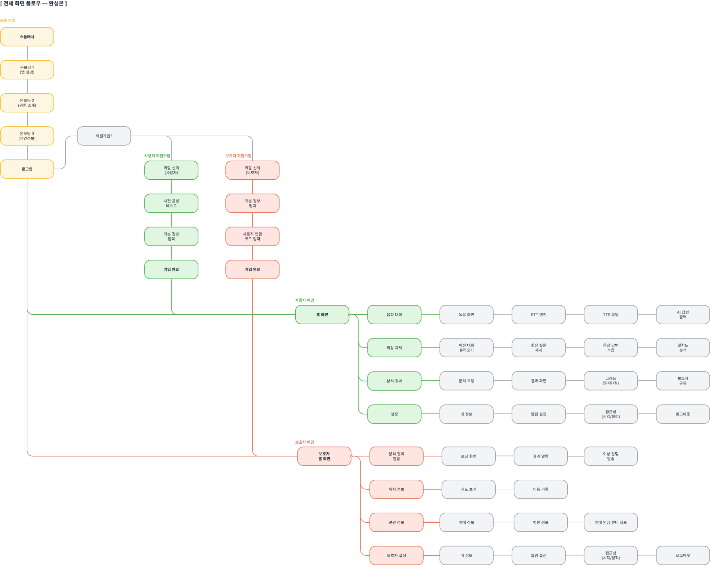
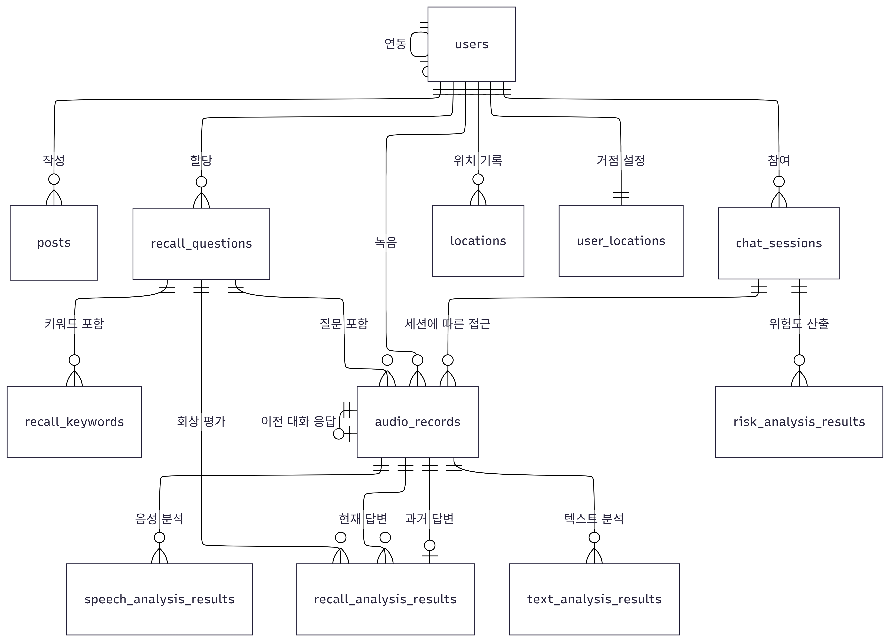
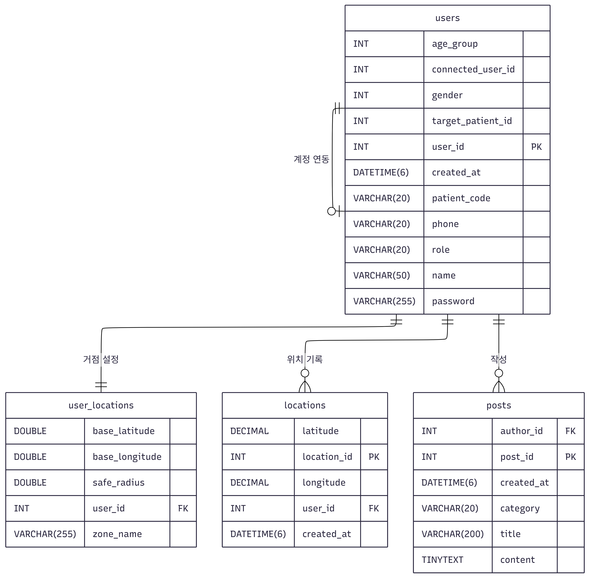
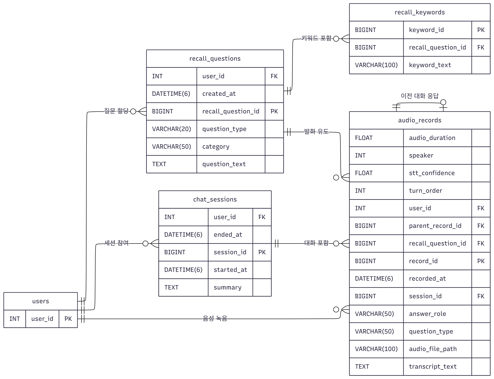
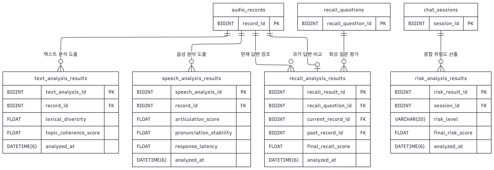

# DSD 문서

영남대학교 컴퓨터공학과

| 학번 | 이름 |
|------|------|
| 22210599 | 김민정 |
| 22210596 | 전선영 |
| 22213490 | 이주연 |
| 22112045 | 김형섭 |
| 22012158 | 김경빈 |
| 22113640 | 김동현 |

---

## 목차

1. [시스템 개요](#1-시스템-개요)
   - 1.1 [프로젝트의 개요](#11-프로젝트의-개요)
   - 1.2 블록 다이어그램
2. [데이타 베이스 설계](#2-데이타-베이스-설계)
   - 2.1 Schema 및 ER 다이아그램
   - 2.2 각 테이블의 자료구조

---

## 1. 시스템 개요

### 1.1 프로젝트의 개요

본 프로젝트는 사용자와 AI 간의 일상 음성 대화를 매일 루틴으로 수행하고, 음성 데이터의 음향적·언어적 특징 분석과 저장된 기록 기반의 기억 일치도 평가를 통해 인지기능 저하 고위험 가능성을 조기에 선별하는 안드로이드 애플리케이션이다.

앱은 사용자와 보호자 두 가지 역할로 분리 운영되며, 회원가입 시 역할을 선택하고 사용자-보호자 간 연결 코드를 통해 계정을 연동한다. 사용자는 매일 음성 대화 루틴을 수행하고 분석 결과를 확인하며, 보호자는 사용자의 분석 결과 열람, 위치 정보 조회, 이상 징후 알람 수신 등의 기능을 제공받는다.

앱의 전체적인 흐름은 다음과 같다.

**[그림] 앱 Flow Chart**

## 2. 데이타 베이스 설계

### 2.1. Schema 및 ER 다이아그램

데이타 베이스의 스키마는 아래와 같다.

* 회원 (Users)
* 테이블 구조: Users( user_id, email, password, name, role, age_group, gender, patient_code, connected_user_id, created_at )
* 설명: 환자와 보호자의 통합 계정 정보. patient_code는 환자 식별 코드이며, connected_user_id를 통해 보호자와 환자 계정 연동

* 실시간 위치 기록 (Locations)
* 테이블 구조: Locations( location_id, latitude, longitude, created_at, user_id )
* 설명: 사용자의 실시간 위도, 경도 좌표와 해당 위치가 기록된 시간 정보

* 사용자 거점 설정 (UserLocations)
* 테이블 구조: UserLocations( user_id, base_latitude, base_longitude, safe_radius, zone_name )
* 설명: 환자의 집이나 병원 등 주요 거점 좌표와 안심 구역 판정을 위한 안전 반경(safe_radius) 설정 정보

* 자유 게시판 (Posts)
* 테이블 구조: Posts( post_id, title, content, category, author_id, created_at )
* 설명: 보호자 커뮤니티 등에서 사용되는 게시물 정보로 카테고리와 작성자 ID 포함

* 회상 질문 (RecallQuestions)
* 테이블 구조: RecallQuestions( recall_question_id, question_text, question_type, category, user_id, created_at )
* 설명: 환자의 인지 능력 확인을 위해 등록된 과거 기억 관련 맞춤형 질문 데이터

* 정답 키워드 (RecallKeywords)
* 테이블 구조: RecallKeywords( keyword_id, keyword_text, recall_question_id )
* 설명: 회상 질문에 대한 환자 답변의 일치 여부를 판별하기 위해 설정된 핵심 키워드 목록

* 대화 세션 (ChatSessions)
* 테이블 구조: ChatSessions( session_id, user_id, started_at, ended_at, summary )
* 설명: 환자와 시스템 간의 대화 단위인 세션 정보이며, 종료 시 전체 대화에 대한 요약(summary) 저장

* 음성 녹음 및 답변 (AudioRecords)
* 테이블 구조: AudioRecords( record_id, transcript_text, audio_file_path, audio_duration, speaker, stt_confidence, turn_order, answer_role, question_type, recorded_at, user_id, session_id, parent_record_id, recall_question_id )
* 설명: 환자의 답변 음성 파일 경로와 STT(음성-텍스트 변환) 결과물 및 발화 순서 등의 상세 녹음 정보

* 회상 답변 분석 결과 (RecallAnalysisResults)
* 테이블 구조: RecallAnalysisResults( recall_result_id, final_recall_score, keyword_score, similarity_score, analyzed_at, current_record_id, past_record_id, recall_question_id )
* 설명: 환자의 답변(current_record)을 과거 기록(past_record)이나 키워드와 비교하여 계산된 회상 정확도 분석 결과

* 음성 특성 분석 결과 (SpeechAnalysisResults)
* 테이블 구조: SpeechAnalysisResults( speech_analysis_id, speech_rate, articulation_score, avg_pause_duration, filler_count, pronunciation_stability, repetition_count, response_latency, analyzed_at, record_id, ... )
* 설명: 발화 속도, 정지 시간, filler, 발음 안정도 등 음성 신호의 물리적 특성을 분석한 데이터

* 텍스트 언어 분석 결과 (TextAnalysisResults)
* 테이블 구조: TextAnalysisResults( text_analysis_id, word_count, sentence_count, avg_sentence_length, lexical_diversity, repeated_word_ratio, topic_coherence_score, analyzed_at, record_id )
* 설명: 답변 텍스트의 어휘 다양성, 문장 완성도, 주제 일관성 등 언어학적 지표를 분석한 결과

* 종합 위험도 분석 결과 (RiskAnalysisResults)
* 테이블 구조: RiskAnalysisResults( risk_result_id, risk_level, final_risk_score, recall_score, speech_score, text_score, session_id, analyzed_at )
* 설명: 회상, 음성, 텍스트 분석 점수를 종합하여 최종 인지 장애 위험 단계(risk_level)를 판정한 결과

ER 다이아그램은 아래와 같다.

**[그림] Overview ER Diagram**
각 테이블 내의 컬럼은 생략하고, 어떤 테이블들이 서로 어떻게 연결되어 있는지만 거시적으로 보여주는 다이아그램이다.

**[그림] User & Location Diagram**
회원 계정을 중심으로 실시간 위치, 안심 구역 거점, 게시판 커뮤니티 활동을 묶은 다이아그램이다.

**[그림] Chat Session & Recall Diagram**
사용자가 대화 세션에 참여하고, 회상 질문을 받아 음성 답변을 남기는 과정을 보여준다.

**[그림] Analysis System Diagram**
녹음된 음성을 바탕으로 다각적인 분석(음성, 텍스트, 회상 정확도)이 이루어지고, 최종 위험도를 평가하는 구조의 다이아그램이다.

---

