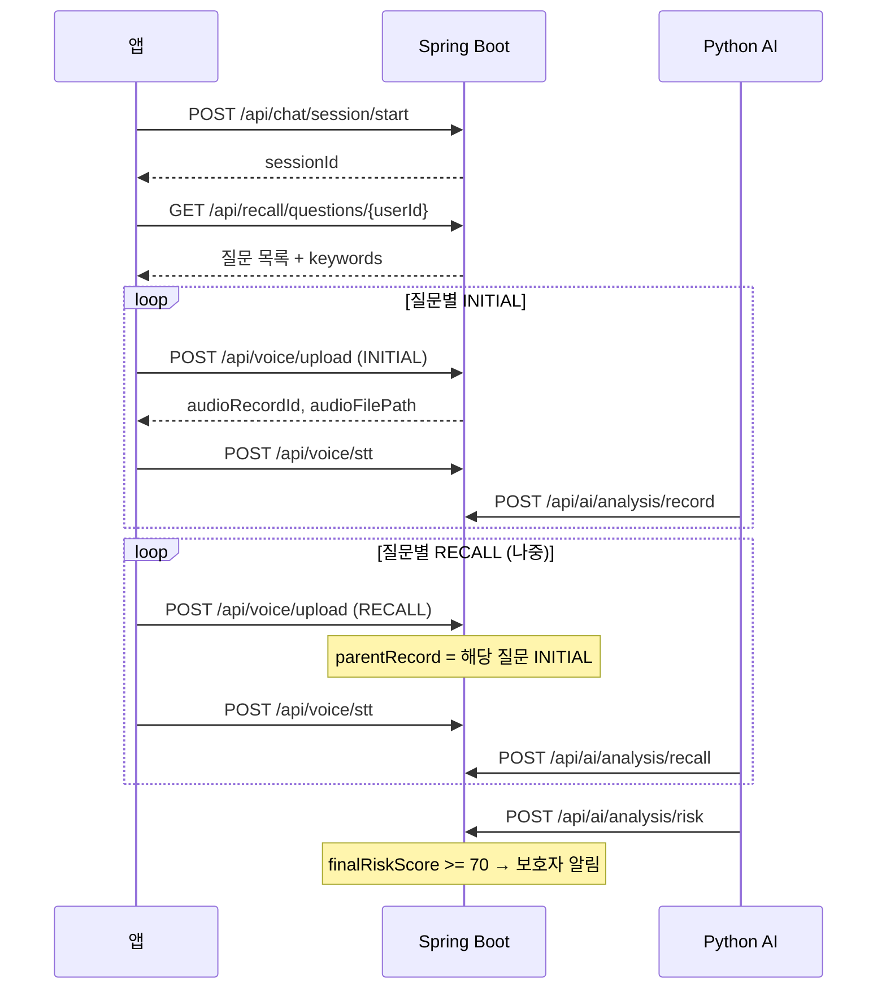

# MIDAS 백엔드 ↔ AI 통합 가이드 

## 0. 한 줄 요약

| 역할 | 담당 |
|------|------|
| **앱** | 세션 시작 → 음성 업로드(질문·역할 포함) → STT 결과 전달 |
| **Python** | S3 음성 분석 + 회상·위험도 계산 → Spring **3개 POST**로 결과 저장 |
| **Spring** | 파일·메타·분석 결과 DB 저장, 위험 시 보호자 알림 |

**핵심:** Python은 DB에 직접 붙지 않고, **HTTP API만** 호출하는 것이 현재 설계와 맞습니다.

---

## 1. 등장인물

| 역할 | 위치 | 하는 일 |
| --- | --- | --- |
| **앱(Android 등)** | 클라이언트 | 로그인, 대화 시작, 음성 녹음·업로드 (업로드 시 INITIAL/RECALL 역할 명시) |
| **Spring Boot** | `backend/src/main/java/...` | S3 파일 저장, **RECALL 음성 업로드 시 INITIAL 음성과 자동 부모-자식 연결**, STT 텍스트 갱신, **AI 분석 세부 지표 DB 저장**, 보호자 알림 |
| **Python AI #1** | `backend/ai/analysis/` | 음성 파일에서 **음향/텍스트 특징** 추출 및 **발화 이상 점수** 계산 후 전송 |
| **Python AI #2** | `backend/ai/recall/` | **Spring에서 키워드를 조회**해 과거 답 vs 오늘 답 **회상 일치도** 및 종합 위험도 계산 |

---

## 2. 전체 흐름도



---

## 3. API 목록 (통합에 쓰는 것만)

### 3.1 앱·Python 공통

| 순서 | 메서드 | URL | 호출 주체 |
|------|--------|-----|-----------|
| 1 | POST | `/api/chat/session/start?userId=` | 앱 |
| 2 | GET | `/api/recall/questions/{userId}` | 앱 / **Python** |
| 3 | POST | `/api/voice/upload` | 앱 |
| 4 | POST | `/api/voice/stt` | 앱 / Python |
| 5 | POST | `/api/ai/analysis/record` | **Python** |
| 6 | POST | `/api/ai/analysis/recall` | **Python** |
| 7 | POST | `/api/ai/analysis/risk` | **Python** |

### 3.2 인증·위치 (통합과 무관하지만 존재)

- `/api/auth/*` — 가입 시 환자에게 **회상 질문 26개** 자동 생성
- `/api/location/*` — 위치·안심구역 (인지 검사와 별도)

---

## 4. API 상세 (요청·응답)

### 4.1 세션 시작

```
POST /api/chat/session/start?userId=1
```

**응답 (`ApiResponse`):**

```json
{
  "code": 200,
  "message": "Success",
  "data": 7
}
```

`data` = `sessionId` (위험도 POST에 사용).

---

### 4.2 회상 질문 목록 (Python이 꼭 써야 함)

```
GET /api/recall/questions/{userId}
```

**응답:** `ApiResponse` 래퍼 없이 **배열 직접 반환** (주의).

```json
[
  {
    "questionId": 1,
    "questionText": "고향은 어디인가요?",
    "questionType": "DEFAULT",
    "category": "기본정보",
    "keywords": []
  }
]
```

- `questionId` → 업로드·recall POST의 `recallQuestionId`
- `questionType` → Python 가중치 (`FACT` 등). 가입 기본값은 **`DEFAULT`** → 프로토타입 기본 가중치 `(0.4, 0.6)` 적용
- `keywords` → 가입 시 **비어 있을 수 있음** → `keyword_score`는 0에 가깝게 나옴. 운영 전 키워드 등록 전략 필요

---

### 4.3 음성 업로드 (메타데이터 포함)

```
POST /api/voice/upload
Content-Type: multipart/form-data
```

| 필드 | 필수 | 설명 |
|------|------|------|
| `userId` | O | 환자 ID |
| `sessionId` | O | 세션 ID |
| `file` | O | 음성 파일 |
| `recallQuestionId` | 선택 | 회상 질문 ID |
| `answerRole` | 선택 | `INITIAL` 또는 `RECALL` |

**서버 동작 (`VoiceService`):**

- `recallQuestionId`, `answerRole` → `audio_records`에 저장
- `answerRole=RECALL`이면, 같은 `userId` + `recallQuestionId`의 **가장 최근 INITIAL**을 `parentRecord`로 자동 연결

**응답:**

```json
{
  "code": 200,
  "message": "Success",
  "data": {
    "audioRecordId": 123,
    "audioFilePath": "https://...s3.../xxx.wav",
    "turnOrder": 1,
    "recordedAt": "2026-05-23T10:00:00"
  }
}
```

세션별 녹음 목록 전체 조회 API(GET /api/voice/session/{sessionId}/records)가 구현 완료되었으나 오류 가능성 있음.

---

### 4.4 STT 반영

```
POST /api/voice/stt
Content-Type: application/json
```

```json
{
  "recordId": 123,
  "transcriptText": "제 고향은 대구입니다."
}
```

회상 분석·텍스트 특징 추출에 **전사문 필수**.

**대안:** `/api/ai/analysis/record`의 `transcriptText`로도 `audio_records`에 저장 가능 (중복 호출 시 마지막 값 유지).

---

### 4.5 발화·텍스트 분석 결과 저장

```
POST /api/ai/analysis/record
Content-Type: application/json
```

**최소 예시 (Python `audio_features` + `text_features` 반영):**

```json
{
  "recordId": 123,
  "transcriptText": "제 고향은 대구입니다.",
  "speechAnalysis": {
    "pauseCount": 0,
    "totalPauseDuration": 0.0,
    "avgPauseDuration": 0.0,
    "maxPauseDuration": 0.0,
    "rmsMean": 0.05,
    "rmsStd": 0.01,
    "zcrMean": 0.1,
    "zcrStd": 0.02,
    "spectralCentroidMean": 1200.0,
    "spectralCentroidStd": 100.0,
    "mfcc1Mean": -5.0,
    "mfcc1Std": 1.0,
    "mfcc2Mean": 2.0,
    "mfcc2Std": 0.5,
    ~
    "mfcc13Mean": 0.0,
    "mfcc13Std": 0.0,
    "speechRate": 2.5,
    "articulationScore": null,
    "pronunciationStability": null,
    "responseLatency": null,
    "repetitionCount": 0,
    "fillerCount": 0
  },
  "textAnalysis": {
    "wordCount": 5,
    "sentenceCount": 1,
    "avgSentenceLength": 5.0,
    "lexicalDiversity": 1.0,
    "repeatedWordRatio": 0.0,
    "incompleteSentenceCount": 0,
    "topicCoherenceScore": null
  }
}
```

**DB 제약:** `SpeechAnalysisResult`의 pause·rms·mfcc 등 다수 필드가 `nullable = false` → Python에 없는 값은 **0으로 채워서** 보내야 합니다. 해당 부분 0으로 채워지지 않으면 수정 요망

---

### 4.6 회상 분석 결과 저장

```
POST /api/ai/analysis/recall
```

```json
{
  "recallQuestionId": 1,
  "pastRecordId": 10,
  "currentRecordId": 25,
  "similarityScore": 85.5,
  "keywordScore": 100.0,
  "finalRecallScore": 92.4
}
```

- `pastRecordId` = INITIAL 업로드 때 받은 `audioRecordId`
- `currentRecordId` = RECALL 업로드 때 받은 `audioRecordId`
- 첫 질문만 past가 없으면 `null` 또는 `0` (서버가 무시)

---

### 4.7 최종 위험도

```
POST /api/ai/analysis/risk
```

```json
{
  "sessionId": 7,
  "speechScore": 70.0,
  "textScore": 75.0,
  "recallScore": 80.0,
  "finalRiskScore": 25.5,
  "riskLevel": "low"
}
```

**공식 (`recall_score_prototype.py`와 동일):**

```
건강점수 = speechScore×0.3 + textScore×0.2 + recallScore×0.5
finalRiskScore = 100 - 건강점수
```

- `speechScore`, `textScore`, `recallScore`: **높을수록 건강**
- `finalRiskScore`: **높을수록 위험**
- **`finalRiskScore >= 70`** → `NotificationService`로 보호자 알림

---

## 5. Python 모델 — 입력·출력

### 5.1 `backend/ai/analysis` (음성·텍스트)

| 단계 | 입력 | 출력 |
|------|------|------|
| `extract_audio_features_60sec` | S3 URL → 로컬 WAV, **앞 60초** | `rms_*`, `zcr_*`, `spectral_centroid_*`, `mfcc_1~13_mean/std` |
| `speech_abnormality_scoring` | 위 특징 + 참고군 프로필 | `dysarthria_similarity_score`, `speech_abnormality_level`, `speech_abnormality_score`(0/7/15) |
| `extract_text_features` | 전사문 | `word_count`, `lexical_diversity`, `repetition_ratio` 등 |
| `calculate_basic_speech_features` | 텍스트 특징 + 녹음 시간(초) | `speech_rate_word` 등 |

**Java 매핑 (snake → camel, record POST용):**

| Python | JSON 필드 |
|--------|-----------|
| `rms_mean` | `speechAnalysis.rmsMean` |
| `mfcc_3_std` | `speechAnalysis.mfcc3Std` |
| `word_count` | `textAnalysis.wordCount` |
| `repetition_ratio` | `textAnalysis.repeatedWordRatio` |
| `speech_rate_word` | `speechAnalysis.speechRate` (권장) |

#### Python POST 예시 (`/api/ai/analysis/record`)

```json
{
  "recordId": 123,
  "speechAnalysis": {
    "rms_mean": 0.05,
    "dysarthria_similarity_score": 0.512,
    "distance_from_reference": 0.95,
    "speech_abnormality_level": "Medium",
    "speech_abnormality_score": 7
  },
  "textAnalysis": {
    "word_count": 5,
    "slow_speech_flag": 0,
    "long_recording_flag": 1,
    "low_content_slow_speech_flag": 0
  }
}
```
---

### 5.2 `backend/ai/recall` (회상·위험도)

#### A) 규칙·임베딩 (`recall_score_prototype.py`) — **Spring DTO와 1:1**

| 입력 | 출처 |
|------|------|
| `question_type` | `GET /api/recall/questions` |
| `keywords` | 동일 API |
| `past_text`, `current_text` | STT 또는 `/record`의 `transcriptText` |
| `past_record_id`, `current_record_id` | 업로드 응답에서 추적 |

| 출력 | Spring 필드 |
|------|-------------|
| `similarity_score` | `similarityScore` |
| `keyword_score` | `keywordScore` |
| `final_recall_score` | `finalRecallScore` |

#### B) RoBERTa 분류 (`inference_recall_classifier.py`) — **보조**

| 입력 | 비고 |
|------|------|
| `question`, `expected_answer`, `past_answer`, `current_answer` | `expected_answer`는 DB에 없음 → **keywords[0]** 또는 INITIAL 전사 요약 |
-> 해당 파트는 문제 생길 시 python 수정 요망. (expected_answer의 경우 past_answer과 동일하게 처리하는 등 해당 파트 담당과 의논)

---

## 6. 권장 통합 시나리오 (단계별)

### Phase A — 앱만 (Python 없이 데이터 쌓기)

1. 로그인 → `userId`
2. `POST /api/chat/session/start` → `sessionId`
3. `GET /api/recall/questions/{userId}` → 오늘 할 질문 N개 선택
4. 각 질문마다:
   - `upload` (`recallQuestionId`, `answerRole=INITIAL`)
   - `POST /api/voice/stt` (recordId + 전사문)
5. 며칠 후 같은 질문에 대해:
   - `upload` (`recallQuestionId`, `answerRole=RECALL`)
   - `stt` again

### Phase B — Python 워커 (녹음 1건당)

1. `audioFilePath`로 WAV 다운로드
2. `extract_audio_features_60sec` → `RecordAnalysisDTO.speechAnalysis` 채우기 (없는 pause 등은 0 or null)
3. DB/캐시의 `transcriptText`로 `extract_text_features` → `textAnalysis` 채우기
4. `POST /api/ai/analysis/record`

### Phase C — Python 회상 (INITIAL+RECALL 쌍 완료 후)

1. `GET /api/recall/questions/{userId}`
2. 질문별로 저장해 둔 `initialRecordId`, `recallRecordId`, 두 전사문 로드
3. `calculate_similarity_score`, `calculate_keyword_score`, 가중치 → `final_recall_score`
4. `POST /api/ai/analysis/recall`

### Phase D — 세션 마무리

1. 세션(또는 사용자)의 `finalRecallScore` 평균 → `recallScore`
2. 세션 내 record들로 `speechScore`, `textScore` 환산 (아래 7장)
3. `calculate_final_risk` 동일 공식
4. `POST /api/ai/analysis/risk` (`sessionId` 필수)

---

## 7. 점수 환산 (여전히 팀에서 문서화할 부분)

| Python 원천 | 스케일 | `/risk`용 `speechScore` 예시 |
|-------------|--------|-------------------------------|
| `speech_abnormality_score` | 0, 7, 15 (이상↑) | `100 - abnormality×(100/15)` 등 |
| `lexical_diversity` | 0~1 | `lexical_diversity × 100` |
| `final_recall_score` 평균 | 0~100 | 그대로 `recallScore` |

**혼동 금지:** `speech_abnormality_score`를 그대로 `speechScore`에 넣으면 위험도 공식이 깨집니다.

---

## 8. Python 워커가 유지해야 할 상태 

앱이 음성을 업로드할 때마다 Spring이 Python 워커에게 아래와 같은 분석 요청 쪽지(JSON)를 보냅니다. Python은 이 정보를 바탕으로 S3에서 파일을 다운로드해 즉시 분석에 착수합니다.

* 세션 마감 흐름:
앱이 대화를 마치고 POST /api/ai/analysis/chat/session/{sessionId}/complete를 호출하면, Spring은 세션을 닫은 후 Python 서버 주소(http://localhost:포트/api/ai/batch-analysis)로 sessionId와 userId를 담아 POST 요청(트리거)을 보냅니다. 파이썬 팀원은 이 요청을 받는 엔드포인트를 열어두고, 신호가 오면 분석을 시작하면 됩니다.

```json
{
  "recordId": 123,
  "sessionId": 7,
  "userId": 1,
  "recallQuestionId": 5,
  "answerRole": "INITIAL",
  "audioFilePath": "https://midas-s3-bucket/xxx.wav"
}
```

---

## 9. 구현 완료된 추가 고도화 API 목록

기존의 "부족한 API 제안" 구역을 "파이썬/앱 연동용 추가 API 명세"로 변경합니다.

| 메서드 | URL | 호출 주체 | 목적 |
| --- | --- | --- | --- |
| **GET** | `/api/voice/session/{sessionId}/records` | Python | 해당 세션의 모든 녹음 ID, 전사문, S3 URL 목록 일괄 조회 |
| **GET** | `/api/ai/analysis/session/{sessionId}/summary` | 앱 (클라이언트) | 앱 리포트 화면용 최종 위험도 및 지표 요약 반환 |
| **PUT** | `/api/recall/questions/{id}` | 보호자/웹 | 특정 질문의 키워드 목록(`List<String>`) 및 정답 문장 수정 |
| **POST** | `/api/ai/analysis/chat/session/{sessionId}/complete` | 앱 (클라이언트) | 대화 세션 종료 기록 및 **Python 배치 분석 서버 트리거 발동** |

---

## 10. 통합 전 확인 사항 (코드 리뷰 메모)

* **`GET /api/recall/questions`** 는 다른 API와 달리 `ApiResponse` 래퍼 없음 → Python `requests` 파싱 시 `response.json()`이 곧 배열.
* 가입 시 `questionType=DEFAULT`, **keywords=[]** → 회상 키워드 점수는 거의 0. FACT 등으로 바꾸거나 키워드를 넣는 운영 정책 필요.

---

## 11. 최소 성공 테스트 (MVP)

| # | 동작 | 기대 결과 |
|---|------|-----------|
| 1 | 세션 1개 + INITIAL 1건 upload + stt | `audio_records` 행, `answer_role=INITIAL` |
| 2 | 같은 질문 RECALL upload + stt | `parent_record_id` = INITIAL의 id |
| 3 | Python → `/record` 2회 | `speech_analysis_results`, `text_analysis_results` |
| 4 | Python → `/recall` 1회 | `recall_analysis_results` |
| 5 | Python → `/risk` | `risk_analysis_results`, 필요 시 알림 |

---

## 12. API ↔ Service ↔ DB 대응표

| API | Service | 저장 테이블 |
|-----|---------|-------------|
| `/voice/upload` | `VoiceService.uploadAndSave` | `audio_records` |
| `/voice/stt` | `VoiceService.updateTranscript` | `audio_records.transcript_text` |
| `/recall/questions/{userId}` | `RecallQuestionService` | 조회만 |
| `/ai/analysis/record` | `AiAnalysisService.saveRecordAnalysis` | `audio_records`, `speech_analysis_results`, `text_analysis_results` |
| `/ai/analysis/recall` | `saveRecallResult` | `recall_analysis_results` |
| `/ai/analysis/risk` | `saveFinalRiskResult` | `risk_analysis_results` + 알림 |

---

요약 -> 로드 메타 + STT + 질문 조회 + 분석 결과 전체 저장까지 Spring이 받을 준비가 되어 있고, Python은 S3 분석 → record/recall/risk POST와 업로드 시 받은 recordId 추적만 맞추면 통합 뼈대가 완성됩니다.